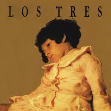

Alicia Berchenko / berchenko

NOMBRE DEL ÁLBUM : La espada y la pared
AÑO DEL ÁLBUM: 1995
ARTISTA: Los tres
TRACKLIST:
1. Déjate caer
2. Hojas de té
3. La espada y la pared
4. Dos en uno
5. Tírate
6. Te desheredo
7. Partir de cero
8. Moizefala
9. V & V
10. Me rompió el corazón
11. La espada
12. Tu cariño se me va
13. All Tomorrow's Parties

ASPECTOS DEL ÁLBUM A DESARROLLAR (PREMISA)
La propuesta busca reinterpretar la atmósfera del álbum La espada & la pared de Los Tres a través de una imagen en movimiento inspirada en su estética melancólica, nocturna y analógica.Se tomó como referencia la sensación de bar nocturno y bohemia chilena, las luces cálidas y oscuras, el contraste entre violencia y romanticismo presente en el nombre del álbum, la textura VHS de los videoclips noventeros, la idea de una espada suspendida como símbolo dramático y emocional.

DISTANCIA ENTRE PREMISA Y RESULTADO
Aunque el resultado logra transmitir una atmósfera oscura y emocional cercana al álbum, hubo varias ideas que no se consiguieron completamente.

COSAS NO CONSEGUIDAS
No conseguí que la espada hiciera una rotación continua de 360° siguiendo el mouse; el movimiento todavía rebota y cambia de dirección.
Quería que la textura VHS tuviera un efecto aún más parecido a una televisión antigua real, con deformaciones y glitches más complejos.

DESCUBRIMIENTOS AL TRABAJAR
Aprendí cómo crear un efecto FLASH usando transparencia y disminuyendo gradualmente la opacidad.
Descubrí cómo generar partículas aleatorias y hacer que desaparezcan lentamente.
Entendí cómo usar random() para crear ruido visual tipo VHS.
Aprendí a detectar interacción real con el mouse usando movedX y movedY.

EXPLICACIÓN DEL CÓDIGO

1. stroke(random(180,255), random(20,70));
point(random(width), random(height));
}

Este bloque crea el ruido visual tipo VHS.
El for repite el código 1200 veces para dibujar muchos puntos aleatorios en pantalla.
i++ significa que el contador aumenta de uno en uno.
random(width) y random(height) generan posiciones aleatorias.
stroke() define el color y transparencia de cada punto.
El resultado es una textura granulada similar a una cinta analógica o televisión antigua.

2. let interacting = movedX !== 0 || movedY !== 0;

Este bloque detecta si el usuario realmente movió el mouse. movedX movimiento horizontal.
movedY mide movimiento vertical.
!== 0 significa “distinto de cero”.
| significa “o”.
Entonces la variable interacting se activa cuando el mouse se mueve en cualquier dirección.
Gracias a esto, las partículas y luces solo aparecen cuando existe interacción real.

3. this.vx = random(-2,2) + movedX * 0.1;
this.vy = random(-3,-1);

this.x += this.vx;
this.y += this.vy;
this.alpha -= 4;

Este bloque controla el movimiento y desaparición de las partículas.
vx es la velocidad horizontal. vy es la velocidad vertical.
random(-2,2) hace que cada partícula se mueva diferente.
movedX * 0.1 hace que el mouse influya en el movimiento.

this.x += this.vx mueve la partícula horizontalmente.
this.y += this.vy la mueve verticalmente.
this.alpha -= 4 reduce su opacidad para que desaparezca lentamente.

DECLARACIÓN USO DE IA
Utilicé Chat gpt gratuito, para preguntarle como podria hacer lo de los puntitos rojos y que desaparecieran 
promt: "como puedo hacer que en el programa p5.js se forme un movimiento y desaparición de particulas con tonos 
rojos a partir del centro del lienzo"

esto fue lo que recibí

let particles = [];

function setup() {
createCanvas(windowWidth, windowHeight);
background(0);
}

function draw() {

// fondo negro
background(0);

// crear partículas constantemente
for(let i = 0; i < 3; i++){
particles.push(new Particle());
}

// actualizar y mostrar partículas
for(let i = particles.length - 1; i >= 0; i--){

particles[i].update();
particles[i].display();

// eliminar partículas invisibles
if(particles[i].alpha <= 0){
particles.splice(i,1);
}
}
}

class Particle {

constructor(){

// nacen desde el centro
this.x = width/2;
this.y = height/2;

// movimiento aleatorio
this.vx = random(-3,3);
this.vy = random(-4,-1);

// tamaño aleatorio
this.size = random(4,15);

// transparencia inicial
this.alpha = 255;

// colores rojizos
this.r = random(180,255);
this.g = random(20,80);
this.b = random(20,50);
}

update(){

// movimiento
this.x += this.vx;
this.y += this.vy;

// desaparecen lentamente
this.alpha -= 4;

// se hacen más pequeñas
this.size *= 0.97;
}

display(){

noStroke();

// color + transparencia
fill(this.r, this.g, this.b, this.alpha);

// dibujar partícula
ellipse(this.x, this.y, this.size);
}
}
